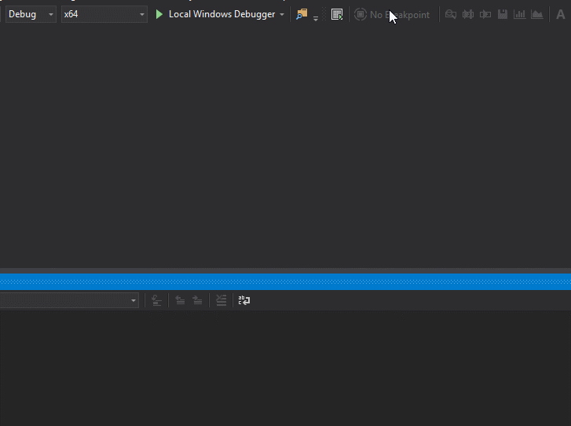
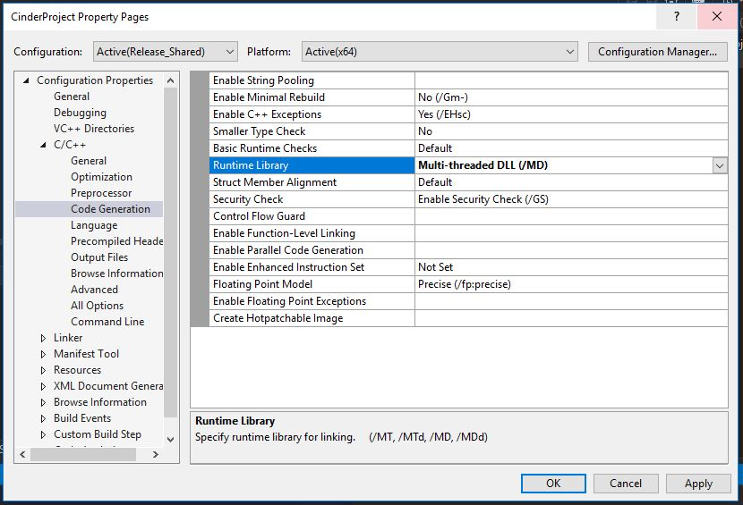
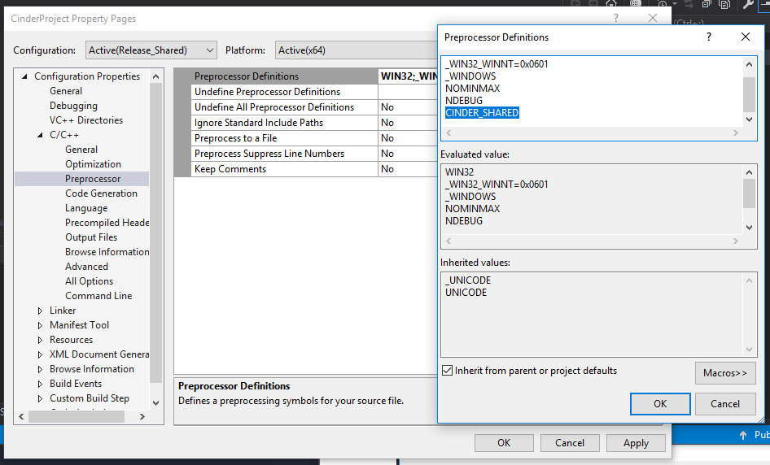
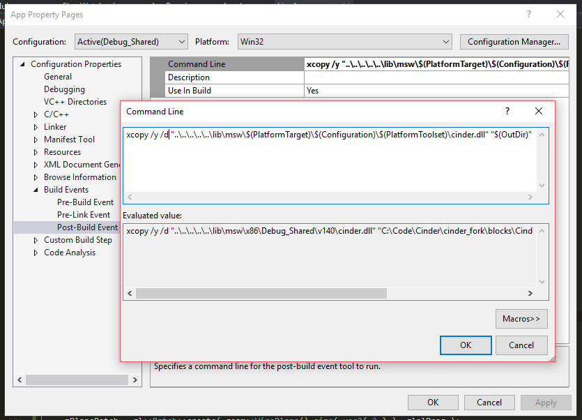
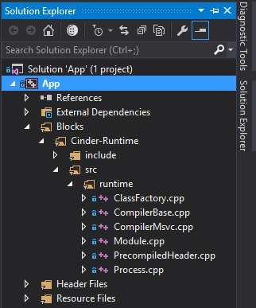

# Runtime

**A runtime compiler for [libcinder](https://libcinder.org).**   

*Previous implementations have moved to [msvc_old](https://github.com/simongeilfus/Cinder-Runtime/tree/msvc_old) and [mac_cling](https://github.com/simongeilfus/Cinder-Runtime/tree/mac_cling) branches.*

### Introduction

*Runtime* is a developement tool that enables fast iteration and prototyping through c++ code hot-swapping. It is lightweight, use your native compiler and is integrated with your IDE and debugger. *Runtime* compilation happens as seamlessly as possible using your IDE error report system and debugger tools.  

One of the core principle of this library is to be able to disappear completly when you don't need it. Every pieces of *Runtime* are designed to become *no-op* when building in `Release` or `Debug` mode. There's a very light setup code to get things running and all of it disappear as soon as you switch to a non runtime target. This makes it easier to integrate *Runtime* in production without the fears and investments of big dependencies.   

### Making a `class` runtime-compilable.

#### `RT_DECL` / `RT_IMPL`
The easiest way to get a `class` watched by the runtime compiler is to use the following macros in both your header and implementation file:
  
`MyClass.h`  
```c++
#pragma once

#include "runtime/ClassWatcher.h"

class MyClass {
public:
	MyClass();

	RT_DECL
};
```
  
`MyClass.cpp`  
```c++
#include "MyClass.h"

MyClass::MyClass() 
{
}

RT_IMPL( MyClass );
```

From that point, any instance of the class `MyClass` **allocated on the heap** will be automatically reloaded when saving the header or the implementation file. Which means that you can use any flavor of smart or raw pointer (the only exception being `std::make_shared`... more on that later). 

  
`SomeOtherFile.cpp`  
```c++
#include "MyClass.h"

 std::unique_ptr<MyClass> mPtr;

 void initialize()
{
	// mPtr will point to the last compiled version of the class
	mPtr = std::make_unique<MyClass>();
}

```

#### `virtual calls`
Now you probably want to call `MyClass` member functions from outside the class and have any future iteration of the code being use instead of the old one. To be able to do this you need to make those member functions `virtual` and let your compiler handle the new indirection:  
  
```c++
#pragma once

#include "runtime/ClassWatcher.h"

class MyClass {
RT_DECL
public:
	MyClass();

	virtual void draw();
};
```
  
#### `rt_virtual`
You probably don't want to deploy code with unecessary virtual calls everywhere. To avoid too much code polution `rt_virtual` can be used instead of `virtual` as it becomes a no-op when building the code in `Release` or `Debug` :  
  
```c++
#pragma once

#include "runtime/ClassWatcher.h"
#include "runtime/Virtual.h"

class MyClass {
RT_DECL
public:
	MyClass();

	rt_virtual void draw();
};
```
  
#### `RT_IMPL_INLINE`
When working on a header only class `RT_IMPL_INLINE` can be used instead of the `RT_DECL` / `RT_IMPL` pair:  
  
```c++
#pragma once

#include "runtime/ClassWatcher.h"
#include "runtime/Virtual.h"

class MyClass {
RT_IMPL_INLINE( MyClass );
public:
	MyClass() {}

	rt_virtual void draw()
	{
		// ...
	}
};
```

#### `std::make_shared`

Unfortunately `std::make_shared` works differently under the hood, making a seemless integration more difficult. At the moment the only way to make a `std::shared_ptr` runtime reloadable is to use the `operator new` or the following wrapper :  
  
```c++
#include "runtime/make_shared.h"

rt::make_shared<MyClass>( ... );
```

#### `rt::Compiler::BuildSettings`

TODO   

### Using `rt::Compiler` and `rt::Module` directly

TODO  

### Adding Runtime to a new or existing project

#### Build Cinder as a dll
Build the `x64` `Debug_Shared` and `Release_Shared` targets of Cinder.

#### Setup the project to use Cinder as a dll by adding the Debug_Shared and Release_Shared targets:

1. Create new configuration for `Debug_Shared` and `Release_Shared` (use "copy setting from" in the configuration manager)  


2. `Project Properties / C++ / Code Generation`: change Runtime Library to `/MDd` for `Debug_Shared` and `/MD` for `Release_Shared`.  


3. `Project Properties / C++ / Preprocessor / Preprocessor Definitions`: Add `CINDER_SHARED` for both `Debug_Shared` and `Release_Shared`.  


4. `Project Properties / Build Events / Post-Build Event / Command Line`: Paste `xcopy /y /d "PATH_TO_CINDER\lib\msw\$(PlatformTarget)\$(Configuration)\$(PlatformToolset)\cinder.dll" "$(OutDir)"` and replace `PATH_TO_CINDER` by the relative path to Cinder (that you can find for example inside `C++ / General / Additional Include Directories`.  


#### Setup the project to use Runtime :

*Ignore the following steps if using Tinderbox.*   

1. `Project Properties / C++ / General / Additional Include Directories` : Add `Cinder-Runtime/include` path to the list of includes.  
2. Drag the content of the `Cinder-Runtime/src` into your Solution Explorer.  
